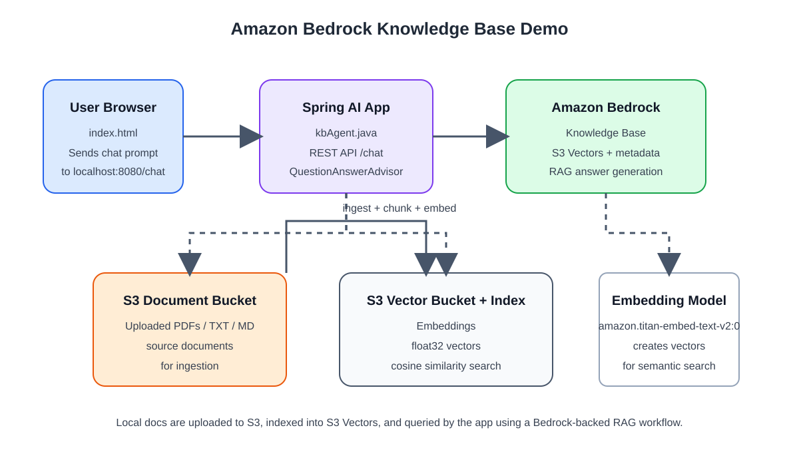

# AGENT.md

## Purpose
This repository is a minimal Amazon Bedrock Knowledge Base demo. It loads documents into S3, creates a vector index with S3 Vectors, configures an IAM role and Bedrock Knowledge Base, and exposes a small Spring AI Java app that answers questions grounded in the indexed content.

## Repository layout
- `setup_knowledgbase_docs.sh` — full end-to-end setup for provisioning AWS resources and ingesting local docs.
- `setup_kb.sh` — older/alternate sample setup script for a smaller demo.
- `run_agent.sh` — resolves the Knowledge Base ID for `kb-demo` and starts the Java app.
- `kbAgent.java` — Spring Boot + Spring AI app exposing `POST /chat`.
- `index.html` — simple browser UI that calls the local `/chat` endpoint.
- PDF and text documents in the repo root are examples that can be uploaded to the knowledge base.

## Required tooling
- AWS CLI configured with valid credentials and access to the target account.
- `jbang` installed for running `kbAgent.java`.
- Region is expected to be `us-east-1` unless you intentionally modify scripts.

## Install jbang
If `jbang` is not already installed, install it before starting the Java app.

### macOS
```bash
# Homebrew
brew install jbang

# Or via SDKMAN
curl -s "https://get.sdkman.io" | bash
source "$HOME/.sdkman/bin/sdkman-init.sh"
sdk install java
sdk install jbang
```

### Linux
```bash
# Official installer
curl -Ls https://sh.jbang.dev | bash

# Or via SDKMAN
curl -s "https://get.sdkman.io" | bash
source "$HOME/.sdkman/bin/sdkman-init.sh"
sdk install java
sdk install jbang

# Debian/Ubuntu examples
sudo apt update
sudo apt install -y curl
curl -Ls https://sh.jbang.dev | bash
```

### Windows
PowerShell:
```powershell
# WinGet
winget install --id jbangdev.jbang -e

# Or Chocolatey
choco install jbang -y

# Or via SDKMAN (requires a Unix-like shell environment such as Git Bash or WSL)
curl -s "https://get.sdkman.io" | bash
source "$HOME/.sdkman/bin/sdkman-init.sh"
sdk install java
sdk install jbang
```

Then verify the installation:

```bash
jbang --version
```

## AWS resource conventions
This project assumes the following names unless changed explicitly:
- Knowledge Base name: `kb-demo`
- Role name: `kb-s3vectors-docs-role` in `setup_knowledgbase_docs.sh`
- Vector index name: `kb-docs-index`
- Data source name: `documents-source`
- Embedding model: `amazon.titan-embed-text-v2:0`

Important: `run_agent.sh` looks up the Bedrock Knowledge Base by the literal name `kb-demo`. If you rename the KB in setup scripts, update `run_agent.sh` too.

## Typical setup flow
1. Configure AWS credentials and ensure the CLI can access the account.
2. Run:
   ```bash
   bash setup_knowledgbase_docs.sh
   ```
   This script will:
   - create the S3 document bucket
   - upload supported files from the repo root (`.pdf`, `.txt`, `.md`)
   - create the S3 Vectors bucket and index
   - set IAM permissions for Bedrock + S3 vectors
   - create a Bedrock Knowledge Base and data source
   - start the ingestion job and wait for completion
3. Launch the Java app:
   ```bash
   bash run_agent.sh
   ```
   This resolves the Knowledge Base ID and runs:
   ```bash
   jbang KbAgent.java
   ```

## Local app behavior
- The application starts as a Spring Boot REST API on port `8080`.
- The endpoint:
  ```http
  POST /chat
  ```
  accepts a plain-text prompt and returns the model response grounded in the connected Knowledge Base.
- The browser UI in `index.html` sends POST requests to `http://localhost:8080/chat`.

## Architecture overview



This architecture follows a simple RAG flow:
- user prompt enters via the browser UI
- `kbAgent.java` calls the Bedrock-backed knowledge base retrieval layer
- source documents are stored in S3 and ingested into S3 Vector storage
- the embedding model creates vector representations for semantic search
- the app returns a grounded answer using the indexed knowledge

## Development guidance for agents
- Keep AWS resource naming consistent across scripts unless the change is intentional and fully propagated.
- Prefer targeted edits to the existing scripts and Java app rather than introducing a new framework or architecture.
- If document ingestion or KB setup changes, update both the setup scripts and the runtime assumptions.
- Validate changes with the smallest relevant command:
  - shell syntax checks for scripts
  - local startup of `jbang KbAgent.java`
  - a quick `curl` check against `/chat` when the app is running
- Do not commit or expose AWS credentials or account details.

## Quick verification commands
```bash
bash -n setup_knowledgbase_docs.sh
bash -n run_agent.sh
jbang KbAgent.java
```

When the app is running, verify the endpoint with:
```bash
curl -X POST http://localhost:8080/chat \
  -H 'Content-Type: text/plain' \
  --data 'What documents are available in this knowledge base?'
```

## Notes
This repo is intentionally a small demo and not a full production deployment. The scripts are the source of truth for AWS provisioning and ingestion behavior; keep them aligned with any changes to the app or configuration.
